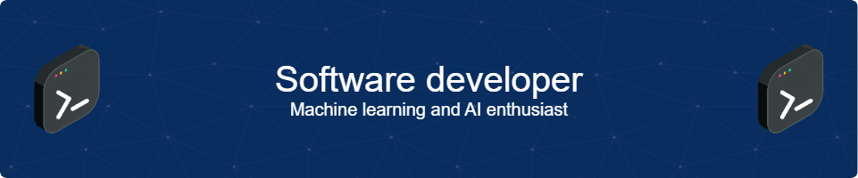

<h1 align="center">Hi 👋, I'm Łukasz Erimus</h1>
<h3 align="center">A passionate developer from Poland who likes to tinker in ML/AI applications. Spend some time figuring out the math behind AI, so I can say with confidence...that I still not quite know everything about it. Still learning and trying my best to pressure myself to be better at coding, but LeetCode is playing on my nerves.</h3>

- 🌱 I’m currently learning **PyTorch, PyQt5, More advanced Deep Learning Networks**

- ⚡ Fun fact **I worked on Federated Learning Project, that was hard**

  <h4>Languages:</h4>
  

    
    
    
  

  <h4>Tools:</h4>
  

    
    
    
    
  

  <h4>Frameworks:</h4>
  

    
    
    
    
  

 

